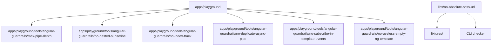

# Angular Custom Guard Rails

A self-contained Angular/Nx showcase demonstrating seven independently testable custom guard rails for code quality enforcement.

## Prerequisites

- **Node.js** >= 18 (LTS recommended)
- **npm** >= 9

## Architecture



- **playground** : Angular app that complies with all seven guard rails; consumes the six ESLint rules from its own standalone copies under `tools/angular-guardrails`, exactly like an application that copied the rules into its own source tree
- **max-pipe-depth** : ESLint rule limiting RxJS pipe operator count
- **no-nested-subscribe** : ESLint rule forbidding subscribe inside subscribe
- **no-index-track** : Angular template ESLint rule forbidding `track $index`
- **no-duplicate-async-pipe** : Angular template ESLint rule forbidding repeated `async` pipes on the same expression within a template scope
- **no-subscribe-in-template-events** : Angular template ESLint rule forbidding `subscribe()` calls inside template event handlers
- **no-useless-empty-ng-template** : Angular template ESLint rule forbidding empty `ng-template` elements without content or template metadata
- **no-absolute-scss-url** : Standalone CLI checker for absolute URLs in SCSS

## Tech Stack

- Angular 22 / Nx 23
- TypeScript 6 / ESLint 9 (flat config)
- typescript-eslint 8 / angular-eslint 22
- Vitest 4
- PostCSS SCSS parser + postcss-value-parser

## Quick Start

```bash
npm install
```

No custom package has to be built or installed: every guard rail is a plain source folder in this workspace, and the SCSS checker runs directly from `dist` once the libraries are built.

Run the full guard rails check:

```bash
npm run guardrails:check
```

## Commands

### Run the full guard rails check

```bash
npm run guardrails:check
```

Runs all tests, all lint tasks, all builds and finally the SCSS checker on `apps/playground/src`. Exits with code `0` only when everything passes. This is also what the CI workflow runs.

### Run all tests

```bash
npx nx run-many -t test
```

### Run all lint checks

```bash
npx nx run-many -t lint
```

### Test a single rule

```bash
npx nx test max-pipe-depth
npx nx test no-nested-subscribe
npx nx test no-index-track
npx nx test no-duplicate-async-pipe
npx nx test no-subscribe-in-template-events
npx nx test no-useless-empty-ng-template
npx nx test no-absolute-scss-url
```

### Lint the playground

```bash
npx nx lint playground
```

## Importing a rule directly

Each rule folder under `apps/playground/tools/angular-guardrails` is a standalone copy that exports a ready-to-use ESLint rule from its `index.ts`. No aggregator package is required: an application imports the rules it needs directly into its local flat config, or copies a single rule folder into its own source tree.

The playground consumes each rule from its own local copy:

```ts
// apps/playground/eslint.config.ts
import { rule as maxPipeDepth } from './tools/angular-guardrails/max-pipe-depth';
import { rule as noNestedSubscribe } from './tools/angular-guardrails/no-nested-subscribe';
import { rule as noIndexTrack } from './tools/angular-guardrails/no-index-track';
import { rule as noDuplicateAsyncPipe } from './tools/angular-guardrails/no-duplicate-async-pipe';
import { rule as noSubscribeInTemplateEvents } from './tools/angular-guardrails/no-subscribe-in-template-events';
import { rule as noUselessEmptyNgTemplate } from './tools/angular-guardrails/no-useless-empty-ng-template';

const customGuardrails = {
  rules: {
    'max-pipe-depth': maxPipeDepth,
    'no-nested-subscribe': noNestedSubscribe,
    'no-index-track': noIndexTrack,
    'no-duplicate-async-pipe': noDuplicateAsyncPipe,
    'no-subscribe-in-template-events': noSubscribeInTemplateEvents,
    'no-useless-empty-ng-template': noUselessEmptyNgTemplate,
  },
};

export default [
  // ...
  {
    files: ['**/*.ts'],
    plugins: { 'custom-guardrails': customGuardrails },
    rules: {
      'custom-guardrails/max-pipe-depth': ['error', { max: 3 }],
      'custom-guardrails/no-nested-subscribe': 'error',
    },
  },
  {
    files: ['**/*.html'],
    plugins: { 'custom-guardrails': customGuardrails },
    rules: {
      'custom-guardrails/no-index-track': 'error',
      'custom-guardrails/no-duplicate-async-pipe': 'error',
      'custom-guardrails/no-subscribe-in-template-events': 'error',
      'custom-guardrails/no-useless-empty-ng-template': 'error',
    },
  },
];
```

### Copying a single rule into your own app

If you only need one rule, copy its folder (for example `apps/playground/tools/angular-guardrails/no-nested-subscribe`) into your application, with no workspace reference and no package installation involved. The folder exports `rule` from `index.ts`, which you register in a flat ESLint plugin:

```ts
// eslint.config.ts
import { rule as noNestedSubscribe } from './tools/angular-guardrails/no-nested-subscribe';

const customGuardrails = {
  rules: { 'no-nested-subscribe': noNestedSubscribe },
};

export default [
  {
    files: ['**/*.ts'],
    languageOptions: {
      parser: tsParser, // @typescript-eslint/parser
      parserOptions: {
        projectService: true,
        tsconfigRootDir: import.meta.dirname,
      },
    },
    plugins: { 'custom-guardrails': customGuardrails },
    rules: { 'custom-guardrails/no-nested-subscribe': 'error' },
  },
];
```

The TypeScript parser (`@typescript-eslint/parser`) is required so rules that rely on the type checker, such as `max-pipe-depth`, can resolve types through `parserOptions.projectService`. `no-nested-subscribe` itself only needs the parsed AST.

### Build the playground

```bash
npx nx build playground
```

### SCSS: check files or folders for absolute URLs

The checker accepts single files, multiple files and directories (directories are walked recursively and only `.scss` files are checked). It prints each violation and exits with code `1` when any is found.

```bash
# Build the checker first
npx nx build no-absolute-scss-url

# Check a single file
node dist/libs/no-absolute-scss-url/src/check.js path/to/file.scss

# Check multiple files
node dist/libs/no-absolute-scss-url/src/check.js file1.scss file2.scss

# Check a whole folder (recursive)
node dist/libs/no-absolute-scss-url/src/check.js apps/playground/src
```

The equivalent Nx target is `check`:

```bash
npx nx run no-absolute-scss-url:check
```

### Full guard rails check

```bash
npm run guardrails:check
```

## Guard Rails

### `max-pipe-depth`

Limits the number of operators passed to an RxJS `pipe()` call. Uses the TypeScript type checker to avoid false positives on non-RxJS `pipe` methods.

```ts
// Valid: 3 operators (at limit)
source$.pipe(map(x => x), filter(Boolean), take(1));

// Invalid: 4 operators (exceeds default limit of 3)
source$.pipe(map(x => x), filter(Boolean), tap(() => {}), take(1));
```

### `no-nested-subscribe`

Forbids `subscribe()` calls inside another `subscribe()` callback. Encourages higher-order mapping operators (`switchMap`, `concatMap`, etc.). Supports arrow callbacks, function expressions, and observer object methods.

```ts
// Valid: using switchMap
outer$.pipe(switchMap(v => inner$)).subscribe(console.log);

// Invalid: nested subscribe
outer$.subscribe(v => inner$.subscribe(inner => console.log(v, inner)));
```

### `no-index-track`

Angular template rule that flags bare `track $index` in `@for` loops, encouraging stable identity tracking.

```html
<!-- Valid: stable identity -->
@for (user of users; track user.id) { <p>{{ user.name }}</p> }

<!-- Invalid: tracking by index -->
@for (user of users; track $index) { <p>{{ user.name }}</p> }
```

### `no-duplicate-async-pipe`

Angular template rule that flags every `async` pipe whose input expression is already piped with `async` earlier in the same template scope. Each occurrence spawns its own subscription with its own lifecycle; aliasing the result once avoids the double subscription.

```html
<!-- Valid: alias the observable result once -->
@let user = user$ | async;
<p>{{ user.name }}</p>

<!-- Invalid: two async pipes on the same observable -->
<p>{{ user$ | async }}</p>
<p>{{ user$ | async }}</p>
```

### `no-subscribe-in-template-events`

Angular template rule that disallows calling `subscribe` on an observable inside a template event handler (`(click)="..."`, ...). Subscribing in an event handler starts a subscription with no lifecycle tied to the view; delegate the operation to the component instead.

```html
<!-- Valid: delegate the subscription to a component method -->
<button (click)="loadUsers()">Load</button>

<!-- Invalid: subscribing inside an event handler -->
<button (click)="users$.subscribe()">Load</button>
```

### `no-useless-empty-ng-template`

Angular template rule that disallows empty `<ng-template>` elements that carry neither content nor template metadata (references, variables, attributes, bindings). Such a template renders nothing and is dead weight in the source.

```html
<!-- Valid: template with content and a reference for ngTemplateOutlet -->
<ng-template #userCard><p>{{ user.name }}</p></ng-template>

<!-- Invalid: empty template without content or metadata -->
<ng-template></ng-template>
```

### `no-absolute-scss-url`

Standalone CLI checker that flags absolute paths in SCSS `url()` declarations. Uses PostCSS SCSS parser for accurate AST analysis.

```scss
/* Valid */
.logo { background-image: url('./logo.svg'); }

/* Invalid */
.logo { background-image: url('/assets/logo.svg'); }
```

## Key Files

| File | Description |
|------|-------------|
| [`libs/max-pipe-depth/src/rule.ts`](libs/max-pipe-depth/src/rule.ts) | RxJS pipe depth rule implementation |
| [`libs/no-nested-subscribe/src/rule.ts`](libs/no-nested-subscribe/src/rule.ts) | Nested subscribe rule implementation |
| [`libs/no-index-track/src/rule.ts`](libs/no-index-track/src/rule.ts) | Template $index tracking rule |
| [`libs/no-duplicate-async-pipe/src/rule.ts`](libs/no-duplicate-async-pipe/src/rule.ts) | Duplicate async pipe rule implementation |
| [`libs/no-subscribe-in-template-events/src/rule.ts`](libs/no-subscribe-in-template-events/src/rule.ts) | Subscribe in template events rule implementation |
| [`libs/no-useless-empty-ng-template/src/rule.ts`](libs/no-useless-empty-ng-template/src/rule.ts) | Empty ng-template rule implementation |
| [`libs/no-absolute-scss-url/src/check.ts`](libs/no-absolute-scss-url/src/check.ts) | SCSS URL checker + CLI entry point |
| [`apps/playground/eslint.config.ts`](apps/playground/eslint.config.ts) | Playground ESLint flat config composing the rules locally with TypeScript parser services |
| [`vitest.workspace.ts`](vitest.workspace.ts) | Vitest workspace configuration |
